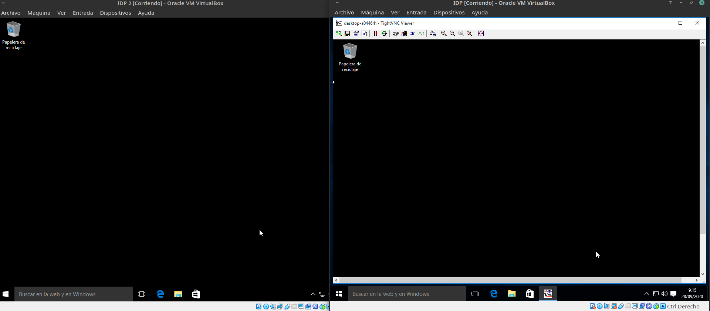
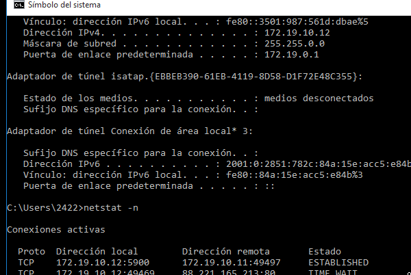

#  **ACCESO REMOTO VNC**

### Componentes del grupo:
* Lucas Hernández Hernández

##### Punto 2.1
Después de haber configurado las máquinas virtuales con sus respectivas ip nos conectaremos del cliente al server mediante su ip con el programa TightVNC, por último usaremos el comando telnet para verificar que existe una conexión entre ambos.

