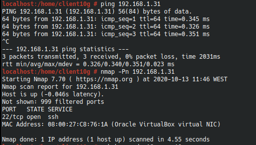
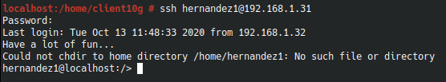
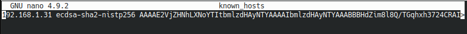
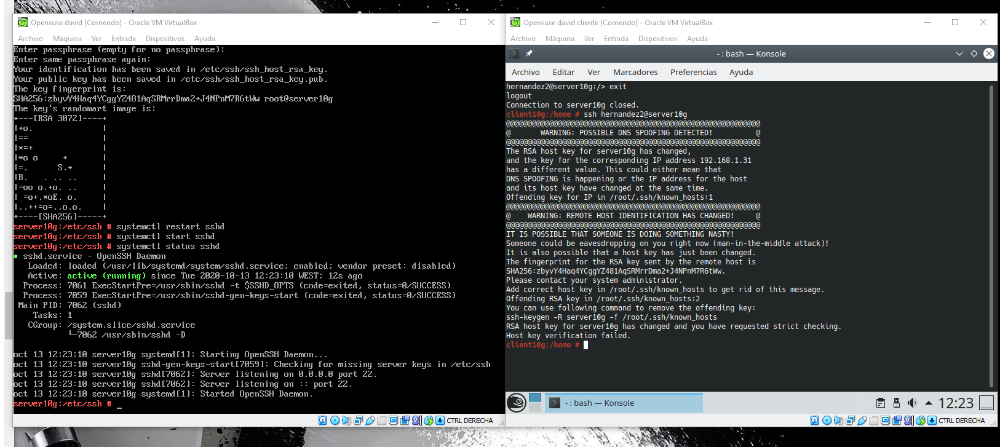
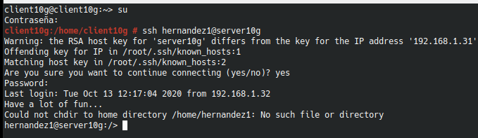
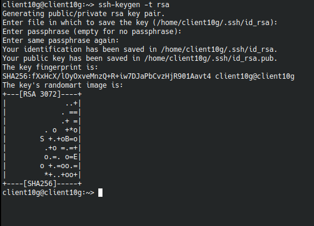
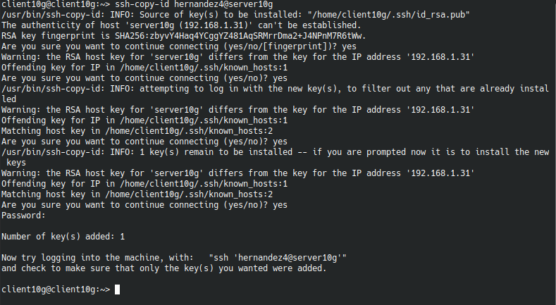
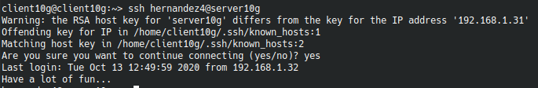

#  **ACCESO REMOTO SSH**

### Componentes del grupo:
* Lucas Hernández Hernández

##### Problemas:
* Algunas capturas tienen diferentes hostname y nombres de máquina, por despiste mio y falta de práctica, a lo largo de la prueba se van solucionando.

##### **Punto 2.2** Primera conexión con SSH Linux
Primero comprobaremos la conexión desde el cliente haciendo un ping al servidor para ver si tenemos conectividad entre ambos, a continuación realizaremos un nmap para comprobar los puertos abiertos de nuestro servidor.

Ahora desde el cliente nos conectaremos mediante ssh a uno de los usuarios creados anteriormente del servidor.

En concreto use hernandez1@192.168.1.31 que es la ip del servidor porque el dns no funcionaba por un error de configuración, aunque ya esta arreglado, y se puede ver en las siguientes capturas.

Por último haremos una última comprobación desde el cliente para verificar que ha habido una conexión.

##### **Punto 3.2** comprobación del ssh Linux
Después de haber realizado correctamente el apartado 3.1 nos debería salir el error de la imagen que indica que la contraseña no está actualizada.

Como se puede ver, el mismo error nos indica que es lo que tenemos que hacer para solucionar el problema por lo que escribimos el comando y solucionamos el problema.

##### **Punto 5** Autentificación mediante clave pública
Para comenzar el apartado 5, desde el cliente de linux crearemos un nuevo par de claves de user.

Una vez creadas las copiaremos con el comando ssh-copy-id a nuestro user "Apellido4" del servidor.

Ahora al entrar a nuestro usuario "Apellido4" no tendríamos que entrar con la contraseña, ya que el propio server no nos la pedirá.

##### **Punto 6** Uso de SSH como túnel para X

Instalaremos en el servidor una app de entorno gráfico como el Gean, dentro del server de OpenSuse  cambiaremos la configuración para permitir las aplicaciones gráficas en SSH.

IMAGEN 1 (FICHERO MODIFICADO)

Ahora en el cliente, comprobaremos que no tenemos instalada la aplicación, una vez comprobado nos conectaremos de forma remota al "Apellido1" y ejecutaremos la aplicación.

IMAGEN 2 (aplicación abierta desde el cliente conectado al ssh del servidor)

##### **Punto 8.1** Restricción sobre un usuario

Ahora crearemos una restricción para el usuario "Apellido2", por lo que a partir de ahora desde los clientes no podremos acceder por ssh al usuario "Apellido2".

IMAGEN 1 (Sin acceso desde el cliente a hernandez2)

##### **Punto 9** Servidor SSH en Windows

Añadiremos en el archivo hosts los equipos client10g y client10w, a continuación comprobaremos la conectividad con un ping.

IMAGEN 1 (Clientes añadidos en el ficher hosts)

IMAGEN 2 (Ping a los clientes)

Por último comprobaremos el acceso SSH desde los clientes al servidor windows con los comandos, netstat para windows y lsof para linux.

IMAGEN 3 (netstat con Windows)

IMAGEN 4 (lsof con Linux)
