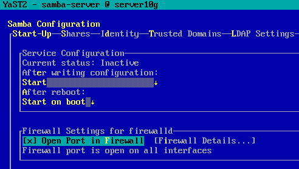
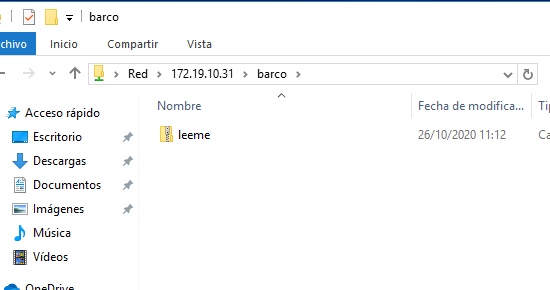
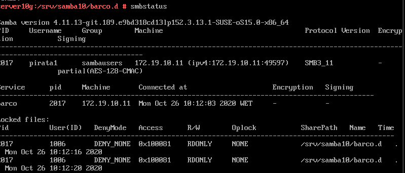
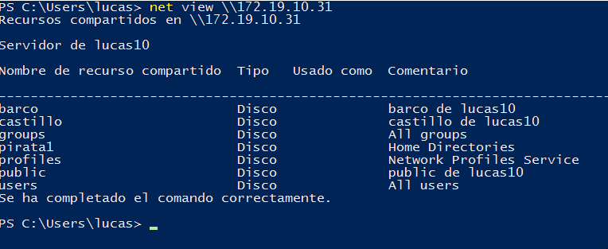
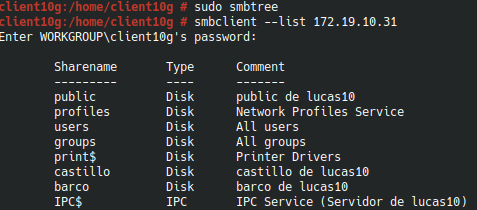

#  **Samba con OpenSuse y Windows**

### Componentes del grupo:
* Lucas Hernández Hernández

##### **Punto 1.4** Configurar el servidor Samba

Primero haremos una copia de seguridad del fichero de configuración de samba, una vez hecho iremos a la herramienta yast y en "Workgroup" pondremos curso2021, en la pestaña de inicio seleccionaremos la opción de iniciar samba cuando encendamos la máquina, por último en el cortafuegos nos aseguraremos de que tenemos los puertos abiertos.

##### **Punto 1.5** Crear los recursos compartidos en red

Ahora configuraremos los recursos compartidos en nuestra red, podemos hacerlo por yast, aunque es mucho más cómodo hacerlo directamente desde el fichero de configuración "etc/samba/smb.conf" una vez editado, usamos el comando "testparm" para verificar que nuestro documento fue editado perfectamente y no hay ningún fallo.

##### **Punto 2.1** Cliente Windows GUI

Dado que ya hemos configurado todo, probaremos a editar archivos desde un cliente windows, para ello en el apartado de búsqueda de carpetas de Windows escribiremos la ip de nuestro servidor samba, una vez puesta nos deberían aparecer todas las carpetas que anteriormente creamos, para finalizar el apartado simplemente sacamos captura del comando "smbstatus" y "lsof -i" para verificar que ha habido una conexión.

##### **Punto 2.2** Cliente Windows comandos

Ahora abriremos un modo comando de windows para verificar que no tenemos ninguna conexión activa, en caso contraro las cerramos, a continuación haremos uso del comando "net use" para ver los recursos de nuestra máquina Samba.

También crearemos una conexión montada con el recurso compartido para que cada vez que iniciemos la máquina este lo haga de forma automática

Por último volveremos a comprobar

##### **Punto 3.1** Cliente GNU/Linux GUI

Ahora probaremos la conexión con nuestro recurso Samba desde una máquina Linux

También probaremos a crear archivos dentro de los repositorios

Y volveremos a comprobar

##### **Punto 3.2** Cliente GNU/Linux comandos

Iremos al cliente de linux y mostraremos los recursos smb/cifs con el comando "smbclient", anteriormente hemos usado el comando smbtree para confirmar que no hay nada.

Una vez hecho eso con nuestro usuario root crearemos la carpeta castillo dentro de remoto10 y usaremos el comando mount, para montar la carpeta como si fuera una de nuestro sistema, para confirmar que todo ha sido configurado correctamente escribiremos "df -hT".

Por último comandos de configuración

##### **Punto 3.3** Montaje automático

Para este último paso nos aseguramos (tras haber reiniciado) que los recursos creados en el apartado anterior no se encuentran disponibles dado que eran temporales.

Por último iremos al fichero "/etc/fstab" y añadiremos una nueva linea.

###### Errores.
* Una vez puesta la nueva linea al reiniciar el equipo aparece con una pantalla negra y no se puede hacer nada.
