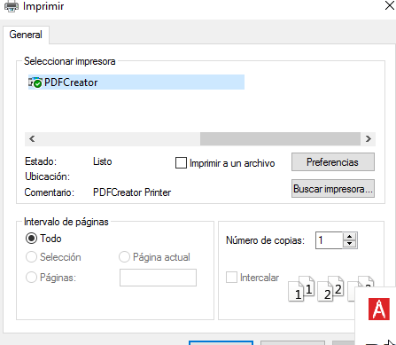

#  **Servidor de Impresión en Windows**

### Componentes del grupo:
* Lucas Hernández Hernández

##### **Punto 1.3** Comprobar que se imprime de forma local

Para este paso crearemos un archivo txt llamado "imprimir10w-local", una vez creado lo imprimiremos seleccionando como impresora el PDFCreator.

##### **Punto 2.2** Comprobar que se imprime de forma remota

Ahora buscaremos el recurso de red, buscaremos en la carpeta del cliente la ip del servidor, una vez dentro del recurso iremos a las propiedades de la impresora y nos conectaremos, por último imprimiremos el archivo "Imprimir10w-remoto"

##### **Punto 3.3** Comprobar que se imprime desde el navegador

Ahora entraremos a un entorno desde nuestro navegador para poder gestionar nuestras impresoras en red, para hacer comprobaciones de que funciona correctamente pausaremos la impresoras, podemos ver que el archivo que se deseaba imprimir esta en pausa, una vez hecha la comprobación, y para finalizar, volvemos a reanudar la Impresión.

##### **Anexo**

En el apartado Nº2.1 se especifica que el recurso compartido sea "PDFlucas10", en mi caso use el escritorio de la máquina virtual.
