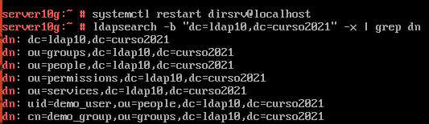
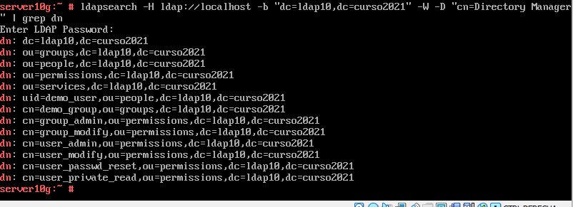
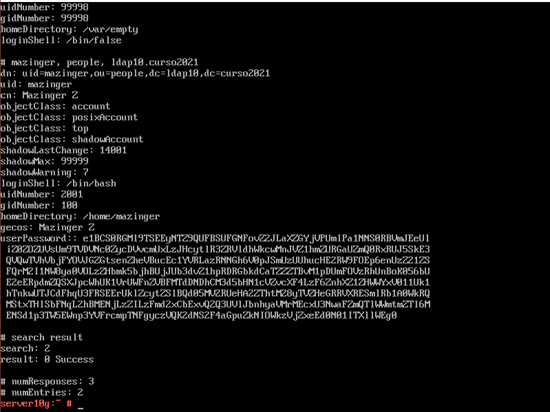
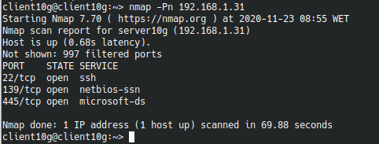
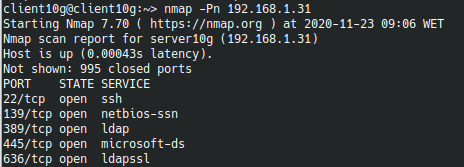
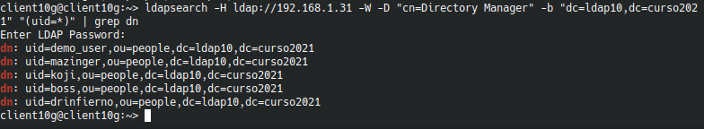

#  **Servidor de Directorio con comandos**

### Componentes del grupo:
* Lucas Hernández Hernández

##### **Punto 2.4** Comprobar contenido del DS LDAP

Escribiremos el comando "ldapsearch -b "dc=ldapXX,dc=curso2021" -x | grep dn" para mostrar el contenido de nuestra base dedatos LDAP.

Ahora con "ldapsearch -H ldap://localhost -b "dc=ldapXX,dc=curso2021" -W -D "cn=Directory Manager" | grep dn" haremos una consulta usando usurio/clave.

##### **Punto 3.3** Comprobar nuevo usuario

Una vez hemos creado el usuario mazinger comprobaremos que fue creado correctamente con el comando "ldapsearch -W -D "cn=Directory Manager" -b "dc=ldapXX,dc=curso2021" "(uid=* )"

##### **Punto 4.3** Comprobar los usuarios creados

Ahora comprobaremos desde el cliente que el puerto LDAP este abierto, en mi caso no lo estaba, por lo que lo abriremos y volveremos a hacer la comprobación con LDAP.

Ahora consultaremos de forma remota los usuarios que tenemos en ldap.

