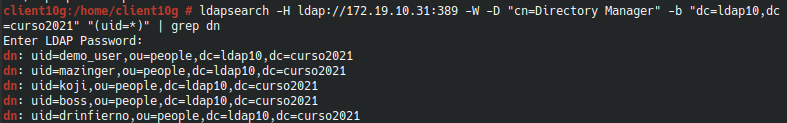

#  **Cliente para autenticación LDAP**

### Componentes del grupo:
* Lucas Hernández Hernández

##### **Punto 1** Preparativos

Para verificar que nuestro servicio LDAP funciona perfectamente escribiremos el siguiente comando:

Ahora comprobaremos que los usuarios son visibles para nuestro cliente

##### **Punto 2.1** Crear conexión con el servidor

Primero verificaremos que nuestro nombre de equipo y de dominio son correctos, ahora iremos a _**YAST -> Cliente LDAP**_ y escribiremos los datos que faltan igual que la imagen de muestra pero basándonos en la información de nuestro servidor.

##### **Punto 4.3** Comprobar los usuarios creados

Ahora comprobaremos desde el cliente que el puerto LDAP este abierto, en mi caso no lo estaba, por lo que lo abriremos y volveremos a hacer la comprobación con LDAP.

