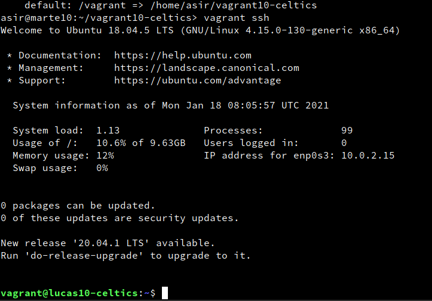

#  **Actividad Vagrant**

### Componentes del grupo:
* Lucas Hernández Hernández

##### **Punto 3.3** Comprobar proyecto 1

Para comprobar que todo ha ido como esperabamos nos aseguraremos de estar dentro de "vagrant10-celtics", ejecutaremos el comando vagrant up para iniciar la estancia y a continuación nos conectaremos a ella con vagrant ssh.

##### **Punto 5.2** Comprobar proyecto 2

Ahora añadiremos una fila que se encargará de configurar los puertos de la estancia, una vez añadida, ejecutaremos el comando vagrant por y veremos como se muestran los puertos de nuestra máquina.

##### **Punto 6.1** Suministro Shell Script

Ahora crearemos el archivo index.html dentro de vagran10-lakers/html e incluiremos un pequeño script html, una vez hecho eso crearemos un script para instalar el apache, por último editaremos el fichero vagrant file añadiendo nuevas lineas.

Finalmente para comprobar dentro del navegador escribiremos 127.0.0.1:4567 para verificar que nos sale el archivo html creado.

##### **Punto 6.2** Suministro Puppet

Ahora crearemos el directorio vagrant10-raptors, y entraremos en el vagrantfile donde incluiremos una linea para installar el puppet, una vez hecho esto crearemos la carpeta manifests junto con su fichero .pp en el que incluiremos las ordenes para instalar el paquete que queramos.

##### **Punto 7.2** Crear Box vagrant

Ahora ejecutaremos el comando "VBoxManage list vms" para saber que id tienen nuestras máquinas, cuando encontremos la nuestra copiaremos su id y la pegaremos en el comando que creara nuestra caja.

Finalmente para comprobar ejecutaremos un vagrant box list para asegurarnos que nuestra caja de vagrant se encuentra en la lista.

