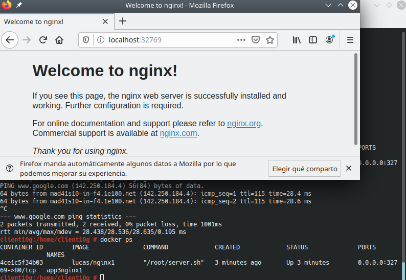
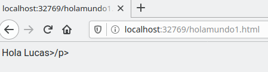
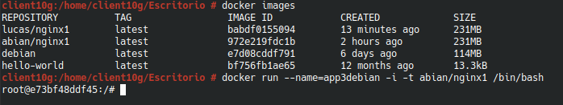
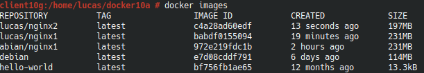
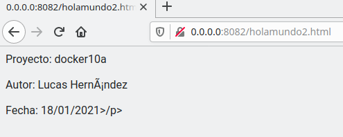
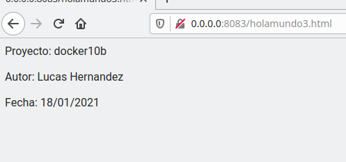
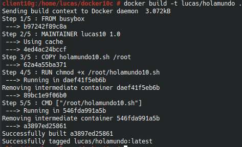
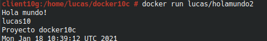
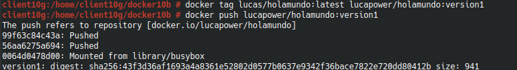

#  **Actividad Docker**

### Componentes del grupo:
* Lucas Hernández Hernández

##### **Punto 3.2** Comprobar

Ahora briremos una termianl, con el comando docker ps veremos que contenedores tenemos en ejecución, ahí podremos ver que puerto está usando nuesta máquina para poder acceder a ella.

Por lo que abriremos el navegador y escribiremos la ip **127.0.0.1** seguida del puerto de la máquina.

##### **Punto 3.3** Migrar imagen

Ahora migraremos una imagen de un compañero de clase, una vez que la tengamos en nuestro poder, ejecutaremos docker load -i (nombre alumno).tar y para verificar que la hemos cargado correctamente usaremos el comando docker images.

##### **Punto 4.2** Crear imagen Dockerfile

Ahora crearemos el directorio **docker10a** , una vez creado construiremos una imagen a partir del dockerfile creado anteriormente, una vez creada, volvemos a comprobar.

##### **Punto 4.3** Crear contenedor

A continuación crearemos un nuevo contenedor, una vez creado usaremos **docker ps** para comprobar que esta en ejecución, por último comprobamos.

Dado que el fichero no tiene el lenguaje en español da problemas con las tildes, por lo que para arreglarlo abría que incluir en la extensión html **lang=es**.

##### **Punto 4.4** Usar imagen de nginx

Ahora crearemos el fichero holamundo3 con un poco de información, crearemos la imagen y el contenedor y comprobaremos el acceso.

##### **Punto 5** Hola Mundo

Por último crearemos un script hola mundo junto con un fichero dockerfile, también volveremos a crear una imagen y comprobaremos con **docker run** para verificar que se crea el script.

Para finalizar nos crearemos una cuenta en Docker Hub y subiremos nuestra imagen.

