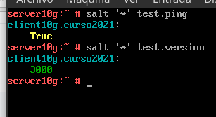
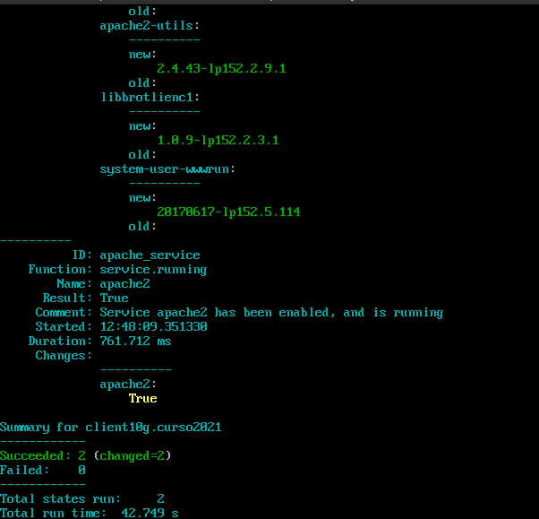
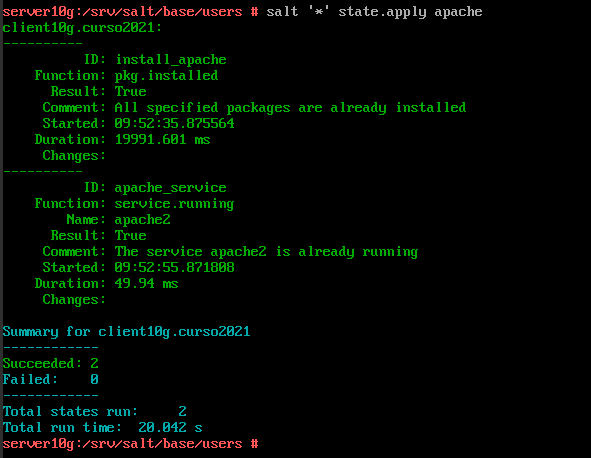
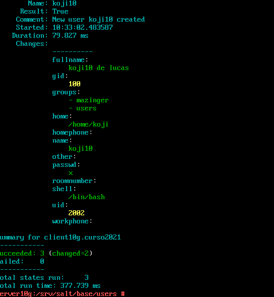
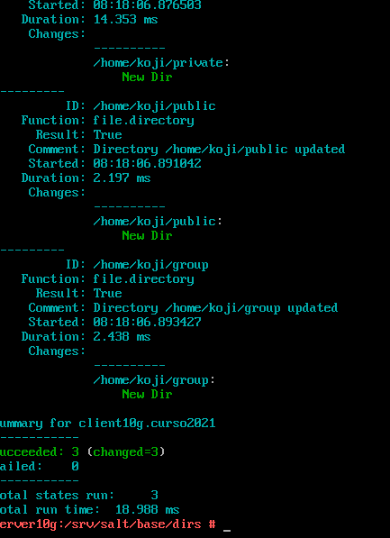
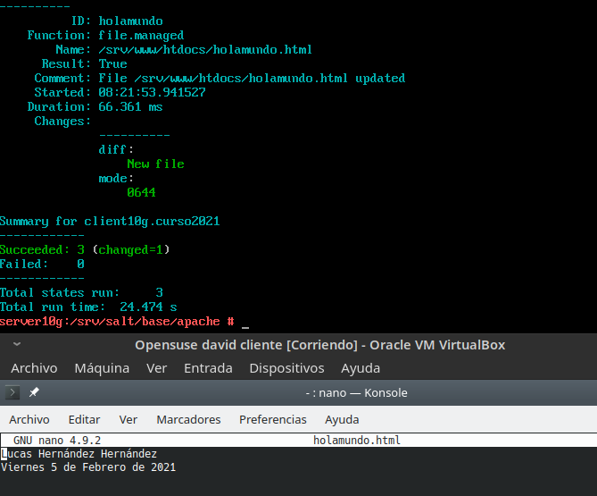

#  **Actividad Salt-stack**

### Componentes del grupo:
* Lucas Hernández Hernández

##### **Punto 3.4** Comprobar la conectividad

Una vez que hemos configurado el master y el minion comprobaremos que existe conexión entre ellos junto con su versión.

##### **Punto 4.5** Aplicar estado (apache)

Bien, ahora que ya hemos comprobado la conexión de nuestras máquinas procederemos a aplicar el estado apache, para verificar que el estado se ha aplicado con éxito la consola nos informará.

##### **Punto 5.1** (Aplicar estado users)

Ahora al igual que antes crearemos un nuevo estado, esta vez con nombre users, crearemos el fichero users/init.sls y definiremos el grupo mazinger junto con los usuarios koji y drinfierno.

Una vez hecho esto aplicaremos el estado users

##### **Punto 5.2** (Aplicar estado files)

Por último crearemos el estado dirs con las carpetas private, public y group.

##### **Punto 5.3** (Aplicar estado apache)

Ahora ampliaremos el estado apache con un nuevo fichero llamado holamundo.

